# Analise de Redes Complexas no Reddit: pontos de articulacao e hubs entre comunidades

**Universidade Federal do ABC**  
**Disciplina:** BCM0506 - Comunicacao e Redes  
**Projeto:** Analise de Redes Complexas no Reddit  
**Base:** SNAP Reddit Hyperlink Network  
**Rede principal:** camada combinada `title + body`

## Resumo

Este trabalho analisa a rede combinada de hyperlinks entre subreddits do Reddit a partir da base publica SNAP Reddit Hyperlink Network. Os subreddits foram modelados como vertices e os hyperlinks entre comunidades como arestas dirigidas, ponderadas e assinadas por sentimento. A analise principal utiliza uma logica de funil: primeiro sao observadas as metricas globais da rede combinada, depois a maior componente conectada, em seguida as centralidades dos vertices, as pontes entre comunidades distintas, os pontos de articulacao e, por fim, o subgrafo formado pelos hubs. O foco teorico parte da transitividade: quando um subreddit A se conecta a B e B se conecta a C, mas A nao se conecta diretamente a C, B pode atuar como intermediario estrutural. Quando a remocao de B fragmenta a componente, B e identificado como ponto de articulacao. Os resultados mostram uma rede grande, esparsa, modular e concentrada em hubs, com destaque para `askreddit`, `iama`, `subredditdrama`, `bestof`, `pics`, `funny`, `writingprompts`, `leagueoflegends`, `bitcoin`, `videos` e `todayilearned`. A analise entre comunidades mostra que `subredditdrama`, `bestof`, `askreddit` e `iama` sao os principais conectores externos. A analise temporal indica que a estrutura central da rede surge cedo e se intensifica ao longo do periodo observado.

**Palavras-chave:** redes complexas; Reddit; pontos de articulacao; hubs; transitividade; comunidades.

## 1. Introducao

O Reddit e uma rede social online organizada em comunidades tematicas chamadas subreddits. Cada subreddit possui seus proprios temas, regras e publico, mas essas comunidades nao funcionam de forma isolada. Usuarios frequentemente citam outras comunidades por meio de hyperlinks em postagens, levando informacoes, discussoes, memes e conflitos de um grupo para outro.

Estudar essa estrutura como uma rede complexa permite investigar como comunidades digitais se conectam. Nesse tipo de abordagem, os subreddits sao tratados como vertices e as referencias entre eles como arestas. A partir dessa representacao, torna-se possivel observar quais comunidades concentram muitas conexoes, quais atuam como intermediarias entre grupos e quais vertices sustentam a conectividade entre partes distintas da rede.

A base usada neste projeto e a Reddit Hyperlink Network da SNAP. Segundo a documentacao da SNAP, a rede representa conexoes direcionadas entre subreddits extraidas de dados publicos do Reddit, cobrindo aproximadamente o periodo de janeiro de 2014 a abril de 2017. A base tambem informa que a rede e dirigida, assinada, temporal e atribuida, e que os hyperlinks podem aparecer tanto no titulo quanto no corpo das postagens.

O objetivo geral deste trabalho e identificar quais subreddits funcionam como pontos de passagem entre diferentes comunidades na rede combinada de hyperlinks do Reddit. Para isso, sao analisadas propriedades estruturais do grafo, com foco em transitividade, componentes conectadas, centralidades, pontos de articulacao e hubs.

A pergunta central pode ser formulada da seguinte maneira: quais subreddits fazem com que comunidades distintas se conhecam estruturalmente, isto e, quais vertices permitem que um caminho entre grupos exista mesmo quando nao ha ligacao direta entre esses grupos?

## 2. Fundamentacao conceitual

### 2.1 Transitividade como ponto de partida

A transitividade parte da ideia de fechamento triadico. Se um vertice `A` esta ligado a `B` e `B` esta ligado a `C`, existe a possibilidade de `A` tambem se ligar a `C`. Em redes sociais, essa propriedade aparece quando contatos ou comunidades intermediarias aproximam grupos que antes estavam separados.

No contexto deste projeto, a transitividade ajuda a interpretar o papel dos subreddits intermediarios. Quando ha um caminho `A -> B -> C`, mas nao ha uma conexao direta entre `A` e `C`, o subreddit `B` pode funcionar como ponte. Se varios caminhos entre comunidades passam por poucos vertices desse tipo, a rede fica dependente desses intermediarios.

Essa dependencia e analisada por meio dos pontos de articulacao. Um ponto de articulacao e um vertice cuja remocao aumenta o numero de componentes conectadas. Portanto, ele nao apenas aparece como intermediario em um caminho; ele sustenta a conectividade de uma parte da rede. No grafo deste trabalho, essa medida e calculada na versao nao direcionada da rede, pois a pergunta de conectividade e se existe ou nao caminho entre os vertices quando a direcao do hyperlink e ignorada.

### 2.2 Centralidade, articulacao e hubs

As metricas de centralidade foram usadas para identificar diferentes formas de importancia estrutural:

| Metrica | Interpretacao no projeto |
| --- | --- |
| Grau de entrada | Popularidade estrutural: quantos subreddits apontam para o vertice |
| Grau de saida | Capacidade emissora: para quantos subreddits o vertice aponta |
| Forca ponderada | Volume de interacoes, considerando repeticao de hyperlinks |
| PageRank | Importancia considerando direcao, peso e importancia de quem aponta |
| Intermediacao | Potencial de ponte em caminhos entre partes da rede |
| Radialidade | Alcance do vertice em relacao aos demais vertices da componente |
| Transitividade | Tendencia de fechamento de triangulos e agrupamento local |
| Ponto de articulacao | Vertice cuja remocao fragmenta uma componente conectada |

Um hub, neste trabalho, e um subreddit com PageRank relevante e conexoes tanto de entrada quanto de saida. Um ponto de articulacao, por outro lado, e definido pela conectividade: sua remocao aumenta o numero de componentes. Assim, todo hub pode ser importante, mas nem todo hub e necessariamente ponto de articulacao; e todo ponto de articulacao e importante para conectividade, mas nem sempre sera o vertice mais popular.

## 3. Metodologia

### 3.1 Dados e modelagem

Os dados foram obtidos a partir da SNAP Reddit Hyperlink Network. A base original disponibiliza dois arquivos principais: um contendo hyperlinks extraidos dos titulos das postagens e outro contendo hyperlinks extraidos do corpo das postagens. Cada registro informa o subreddit de origem, o subreddit de destino, o identificador da postagem, o timestamp, o sinal da interacao e atributos textuais.

No pipeline desenvolvido para o projeto, os arquivos brutos foram carregados e tratados com Python. A biblioteca Pandas foi usada para leitura, limpeza e agregacao dos dados. O DuckDB foi usado para armazenamento local e consultas estruturadas. As bibliotecas NetworkX e igraph foram usadas para modelagem e calculo de metricas de grafo.

Cada subreddit foi definido como um vertice. Cada hyperlink de um subreddit para outro foi definido como uma aresta dirigida. Quando havia mais de uma ocorrencia entre o mesmo par origem-destino, as arestas foram agregadas e o peso passou a representar a quantidade de hyperlinks observados entre os dois subreddits.

Formalmente, a rede foi modelada como:

```text
G = (V, E)
```

em que `V` e o conjunto de subreddits e `E` e o conjunto de hyperlinks dirigidos entre subreddits. Para cada aresta `e = (u, v)`, `u` representa o subreddit de origem e `v` representa o subreddit citado.

A analise principal utiliza a camada `combined`, que agrega hyperlinks presentes em titulos e corpos de postagens. Essa escolha aumenta a cobertura da rede e permite observar a estrutura geral de interacao entre comunidades.

Na camada combinada tratada, foram obtidos 57.559 vertices, 274.698 arestas agregadas e peso total de 671.476 hyperlinks. A diferenca entre esse resultado e as estatisticas globais publicadas pela SNAP deve ser interpretada como efeito do tratamento local: o projeto removeu auto-lacos, normalizou nomes e agregou arestas repetidas por par origem-destino.

### 3.2 Estrategia em funil

A analise foi organizada em funil para reduzir gradualmente a escala do problema:

1. Rede combinada completa: mede ordem, tamanho, densidade, reciprocidade, agrupamento, modularidade e quantidade de componentes.
2. Maior componente conectada: concentra a parte estruturalmente principal da rede e permite avaliar conectividade.
3. Centralidades dos vertices: identifica popularidade, emissao, alcance e potencial de ponte.
4. Pontes entre comunidades: identifica quais vertices conectam comunidades distintas.
5. Pontos de articulacao: identifica vertices cuja remocao fragmenta a maior componente.
6. Hubs: observa o subgrafo dos vertices de maior influencia para interpretar os conectores mais visiveis.
7. Crescimento temporal: acompanha, de forma acumulada por ano, como a rede, os hubs e os pontos de articulacao surgem e se consolidam.

Essa sequencia evita partir diretamente dos hubs. Primeiro o grafo e caracterizado como sistema; depois sao identificados os vertices que explicam a conectividade entre comunidades.

### 3.3 Analise temporal

Para a analise temporal, os arquivos brutos `title` e `body` foram combinados a partir dos timestamps originais. Foram construidos grafos acumulados por ano: 2014, 2015, 2016 e 2017. Em cada ano, o grafo contem todas as arestas observadas ate aquele ano.

Essa abordagem nao mede atividade isolada em cada ano, mas crescimento acumulado da estrutura. Portanto, ela responde a seguinte pergunta: conforme novos hyperlinks aparecem ao longo do tempo, quais subreddits passam a sustentar a conectividade da rede e quais consolidam papel de hub?

O script reprodutivel dessa etapa esta em:

```text
Projeto_CR/reports/analise_temporal_rede_combinada.py
```

As saidas foram salvas em:

```text
Projeto_CR/reports/temporal_combined_growth_metrics.csv
Projeto_CR/reports/temporal_combined_growth_metrics.json
```

Para a analise entre comunidades, foi considerada uma aresta externa quando o subreddit de origem e o subreddit de destino pertencem a comunidades diferentes. O script reprodutivel dessa etapa esta em:

```text
Projeto_CR/reports/analise_entre_comunidades_rede_combinada.py
```

As saidas foram salvas em:

```text
Projeto_CR/reports/intercommunity_pairs_combined.csv
Projeto_CR/reports/intercommunity_node_bridges_combined.csv
Projeto_CR/reports/intercommunity_analysis_combined.json
```

## 4. Resultados

### 4.1 Etapa 1: rede combinada completa

| Metrica | Valor |
| --- | ---: |
| Vertices | 57.559 |
| Arestas agregadas | 274.698 |
| Peso total | 671.476 |
| Links positivos/neutros | 609.299 |
| Links negativos | 62.177 |
| Percentual negativo | 9,26% |
| Grau medio | 9,545 |
| Densidade dirigida | 0,000083 |
| Reciprocidade | 0,181 |
| Componentes fracas | 619 |
| Coeficiente medio de agrupamento | 0,211 |
| Modularidade | 0,556 |
| Comunidades detectadas | 701 |

A rede combinada e grande e esparsa. A densidade dirigida de aproximadamente 0,000083 mostra que apenas uma fracao muito pequena dos pares possiveis de subreddits possui hyperlink observado. Ao mesmo tempo, a modularidade de 0,556 indica que os vertices nao estao distribuidos de modo homogeneo: eles formam comunidades relativamente bem definidas.

O coeficiente medio de agrupamento de 0,211 mostra que existe fechamento local de triangulos, mas esse fechamento nao elimina a dependencia de intermediarios. Em outras palavras, ha transitividade em partes da rede, mas tambem ha regioes em que um subreddit especifico e necessario para conectar grupos que nao possuem ligacao direta suficiente entre si.

### 4.2 Etapa 2: maior componente conectada

| Metrica | Valor |
| --- | ---: |
| Vertices na maior componente | 56.234 |
| Arestas na maior componente | 273.958 |
| Participacao na rede | 97,70% |
| Grau medio | 9,744 |
| Densidade dirigida | 0,000087 |
| Coeficiente medio de agrupamento | 0,216 |
| Caminho medio estimado | 3,073 |
| Diametro | 13 |
| Pontos de articulacao | 7.056 |
| Coesao de vertices | 1 |
| Coesao de arestas | 1 |

A maior componente concentra quase toda a rede. Isso significa que, ignorando a direcao dos hyperlinks, a maior parte dos subreddits pertence a uma mesma estrutura conectada. No entanto, a coesao de vertices igual a 1 e a existencia de 7.056 pontos de articulacao mostram que essa conectividade e vulneravel: a remocao de determinados vertices pode fragmentar partes da componente.

Essa observacao e central para o projeto. A rede parece muito conectada quando se olha apenas a maior componente, mas a analise de articulacao mostra que muitas conexoes entre subgrupos dependem de vertices especificos.

### 4.3 Etapa 3: centralidades dos vertices

#### Receptores mais importantes

| Subreddit | Forca de entrada | Grau de entrada | Comunidade | Papel |
| --- | ---: | ---: | --- | --- |
| `askreddit` | 20.854 | 4.607 | popular / memes | hub |
| `iama` | 11.210 | 3.919 | music / media | hub |
| `pics` | 9.926 | 2.778 | popular / memes | hub |
| `todayilearned` | 8.704 | 2.148 | popular / memes | hub |
| `funny` | 8.336 | 2.453 | popular / memes | hub |
| `videos` | 7.847 | 2.194 | popular / memes | hub |
| `worldnews` | 7.762 | 1.507 | news / politics | hub |
| `news` | 5.807 | 1.306 | news / politics | hub |
| `adviceanimals` | 4.707 | 1.150 | popular / memes | hub |
| `gaming` | 4.610 | 1.384 | gaming | hub |

Esses vertices representam subreddits de alta visibilidade. Eles sao muito citados por outras comunidades e, portanto, funcionam como destinos importantes no fluxo de hyperlinks.

#### Emissores mais importantes

| Subreddit | Forca de saida | Grau de saida | Comunidade | Papel |
| --- | ---: | ---: | --- | --- |
| `subredditdrama` | 23.914 | 2.758 | controversial topics | hub |
| `bestof` | 16.105 | 2.619 | popular / memes | emissor |
| `titlegore` | 6.960 | 1.968 | popular / memes | emissor |
| `shitredditsays` | 5.621 | 717 | popular / memes | emissor |
| `shitpost` | 4.390 | 585 | popular / memes | emissor |
| `switcharoo` | 4.316 | 706 | popular / memes | emissor |
| `circlebroke2` | 4.205 | 491 | popular / memes | emissor |
| `shitamericanssay` | 3.949 | 596 | news / politics | emissor |
| `hailcorporate` | 3.633 | 732 | popular / memes | emissor |
| `shitstatistssay` | 3.392 | 482 | news / politics | emissor |

Esse ranking mostra que popularidade e emissao nao sao a mesma coisa. `askreddit` domina como receptor, mas `subredditdrama`, `bestof` e `titlegore` se destacam como emissores. Isso e importante porque a ponte entre comunidades pode vir tanto de vertices muito citados quanto de vertices que citam muitas comunidades diferentes.

#### Vertices com maior potencial de ponte

| Subreddit | Intermediacao aproximada | Grau total | Comunidade | Papel |
| --- | ---: | ---: | --- | --- |
| `askreddit` | 0,081153 | 4.970 | popular / memes | hub |
| `iama` | 0,069227 | 4.304 | music / media | hub |
| `subredditdrama` | 0,054686 | 3.618 | controversial topics | hub |
| `bestof` | 0,048916 | 3.141 | popular / memes | emissor |
| `pics` | 0,048509 | 2.905 | popular / memes | hub |
| `funny` | 0,044932 | 2.827 | popular / memes | hub |
| `todayilearned` | 0,038821 | 2.431 | popular / memes | hub |
| `videos` | 0,038460 | 2.361 | popular / memes | hub |
| `titlegore` | 0,033535 | 1.986 | popular / memes | emissor |
| `gaming` | 0,029657 | 2.038 | gaming | hub |

Os resultados de intermediacao aproximada reforcam a ideia do funil. Os mesmos vertices que aparecem como grandes receptores ou emissores tambem aparecem como candidatos a pontes. `askreddit`, `iama`, `subredditdrama` e `bestof` sao os casos mais fortes.

### 4.4 Etapa 4: pontes entre comunidades distintas

Para identificar quais vertices conectam comunidades distintas, foram selecionadas apenas as arestas em que a comunidade do subreddit de origem e diferente da comunidade do subreddit de destino. Na rede combinada, foram encontradas 124.697 arestas externas entre comunidades, com peso total de 235.838 hyperlinks. Isso representa aproximadamente 45,39% das arestas agregadas e 35,12% do peso total da rede.

Esse resultado mostra que uma parte expressiva da rede nao ocorre apenas dentro de comunidades tematicas, mas atravessa fronteiras entre grupos. A tabela abaixo mostra os pares direcionados de comunidades com maior peso externo.

| Origem | Destino | Peso externo | Arestas | Negativos (%) |
| --- | --- | ---: | ---: | ---: |
| news / politics | popular / memes | 16.316 | 6.435 | 14,86% |
| controversial topics | popular / memes | 14.674 | 4.418 | 26,66% |
| popular / memes | news / politics | 14.540 | 4.942 | 14,97% |
| popular / memes | controversial topics | 8.403 | 3.562 | 18,17% |
| controversial topics | news / politics | 8.163 | 2.177 | 27,20% |
| popular / memes | gaming | 6.370 | 2.759 | 10,96% |
| popular / memes | music / media | 5.523 | 2.228 | 9,03% |
| sports | popular / memes | 4.804 | 2.526 | 9,53% |
| news / politics | controversial topics | 4.066 | 2.021 | 18,89% |
| popular / memes | sports | 4.027 | 2.056 | 10,40% |

Os pares com maior peso envolvem principalmente `popular / memes`, `news / politics` e `controversial topics`. Isso indica que a circulacao entre comunidades distintas nao e aleatoria: ela se concentra em blocos amplos e altamente conectados. A relacao entre `controversial topics` e `popular / memes`, por exemplo, possui percentual negativo mais alto que as relacoes envolvendo apenas `popular / memes` e `news / politics`, sugerindo que parte dessas conexoes pode estar associada a conflito, critica ou exposicao de discussoes de outros subreddits.

Em seguida, foi calculada a forca externa de cada subreddit. Essa medida soma os pesos das arestas incidentes ao vertice que atravessam comunidades diferentes. Tambem foi contado o numero de comunidades externas distintas conectadas por cada subreddit.

| Subreddit | Comunidade | Papel | Forca externa | Saida externa | Entrada externa | Comunidades externas | Ponto de articulacao | Componentes apos remocao |
| --- | --- | --- | ---: | ---: | ---: | ---: | --- | ---: |
| `subredditdrama` | controversial topics | hub | 22.177 | 20.268 | 1.909 | 46 | sim | 95 |
| `bestof` | popular / memes | emissor | 11.321 | 10.594 | 727 | 41 | sim | 76 |
| `askreddit` | popular / memes | hub | 10.647 | 569 | 10.078 | 45 | sim | 722 |
| `iama` | music / media | hub | 10.080 | 882 | 9.198 | 43 | sim | 434 |
| `todayilearned` | popular / memes | hub | 4.952 | 394 | 4.558 | 40 | sim | 159 |
| `pics` | popular / memes | hub | 4.350 | 79 | 4.271 | 43 | sim | 271 |
| `worldnews` | news / politics | hub | 4.194 | 112 | 4.082 | 37 | sim | 94 |
| `gaming` | gaming | hub | 3.968 | 782 | 3.186 | 39 | sim | 134 |
| `titlegore` | popular / memes | emissor | 3.883 | 3.877 | 6 | 43 | sim | 87 |
| `videos` | popular / memes | hub | 3.833 | 125 | 3.708 | 43 | sim | 165 |

Essa tabela mostra que existem dois perfis principais de ponte entre comunidades. O primeiro e o perfil receptor, representado por `askreddit`, `iama`, `pics`, `todayilearned`, `videos` e `worldnews`: esses subreddits recebem muitas conexoes externas vindas de comunidades diferentes. O segundo e o perfil emissor, representado por `subredditdrama`, `bestof` e `titlegore`: esses subreddits apontam para muitas comunidades distintas e, por isso, funcionam como distribuidores de referencias entre grupos.

`subredditdrama` e o conector externo mais forte da rede. Ele atravessa 46 comunidades diferentes e possui 22.177 de forca externa, concentrada principalmente em saidas. Isso confirma sua funcao estrutural de observar e referenciar outras comunidades. `askreddit`, por outro lado, possui perfil inverso: sua forca externa vem principalmente de entradas, o que indica que muitas comunidades diferentes apontam para ele.

A intersecao entre forca externa e ponto de articulacao e o resultado mais importante desta etapa. Todos os dez principais conectores entre comunidades tambem sao pontos de articulacao. Portanto, esses subreddits nao apenas ligam comunidades diferentes; eles tambem sustentam caminhos cuja remocao fragmenta a maior componente.

### 4.5 Etapa 5: pontos de articulacao

Na maior componente conectada da rede combinada, foram encontrados 7.056 pontos de articulacao. Esses vertices sao importantes porque sua remocao aumenta o numero de componentes da rede.

| Subreddit | Componentes apos remocao | Grau na maior componente | Comunidade | Papel |
| --- | ---: | ---: | ---: | --- |
| `askreddit` | 722 | 4.709 | 21 | hub |
| `writingprompts` | 445 | 1.463 | 6 | hub |
| `iama` | 434 | 4.023 | 7 | hub |
| `funny` | 301 | 2.632 | 21 | hub |
| `pics` | 271 | 2.835 | 21 | hub |
| `leagueoflegends` | 227 | 1.077 | 42 | hub |
| `tipofmypenis` | 185 | 519 | 16 | emissor |
| `bitcoin` | 182 | 1.205 | 3 | hub |
| `videos` | 165 | 2.263 | 21 | hub |
| `todayilearned` | 159 | 2.286 | 21 | hub |

`askreddit` e o principal ponto de articulacao identificado. Sua remocao gera 722 componentes, indicando que muitos ramos perifericos ou subgrupos dependem dele para permanecer conectados a maior componente. `writingprompts` tambem se destaca: apesar de nao ser o maior subreddit por grau total, sua remocao gera 445 componentes, mostrando que ele sustenta a conexao de uma parte relevante da rede.

Esse resultado responde diretamente a pergunta do projeto. Existem subreddits que fazem comunidades distintas interagirem indiretamente. Quando esses subreddits sao removidos, a rede perde caminhos e se fragmenta.

### 4.6 Etapa 6: hubs

No pipeline local, foram identificados 91 vertices classificados como `hub` na rede combinada final. Ao considerar apenas as arestas entre esses hubs, o subgrafo induzido possui 2.907 arestas.

Os hubs mais recorrentes nas metricas sao:

| Subreddit | Grau total | Forca total | PageRank | Papel estrutural |
| --- | ---: | ---: | ---: | --- |
| `askreddit` | 4.970 | 22.192 | 0,022592 | receptor, ponte e articulacao |
| `iama` | 4.304 | 12.393 | 0,018799 | receptor, ponte e articulacao |
| `subredditdrama` | 3.618 | 26.900 | 0,001386 | emissor, ponte e articulacao |
| `pics` | 2.905 | 10.106 | 0,011103 | receptor, ponte e articulacao |
| `funny` | 2.827 | 9.055 | 0,009467 | receptor, ponte e articulacao |
| `todayilearned` | 2.431 | 9.622 | 0,006889 | receptor, ponte e articulacao |
| `videos` | 2.361 | 8.065 | 0,009018 | receptor, ponte e articulacao |
| `gaming` | 2.038 | 6.240 | 0,005666 | hub tematico |

O subgrafo de hubs funciona como o topo do funil. Ele mostra a espinha dorsal visivel da rede: poucos vertices concentram grande parte da circulacao e muitos deles tambem sao pontos de articulacao. Em 2017, todos os 91 hubs identificados tambem aparecem como pontos de articulacao na maior componente, indicando forte sobreposicao entre influencia e fragilidade estrutural.

### 4.7 Etapa 7: crescimento temporal

A tabela a seguir mostra a evolucao acumulada da rede combinada por ano.

| Ano | Vertices | Arestas | Peso total | Maior componente | Hubs | Pontos de articulacao | Novos pontos de articulacao |
| ---: | ---: | ---: | ---: | ---: | ---: | ---: | ---: |
| 2014 | 23.467 | 91.910 | 191.682 | 96,87% | 96 | 3.395 | 3.395 |
| 2015 | 42.281 | 193.913 | 455.135 | 97,63% | 95 | 5.459 | 2.545 |
| 2016 | 54.934 | 261.241 | 634.961 | 97,74% | 95 | 6.735 | 1.709 |
| 2017 | 57.559 | 274.698 | 671.476 | 97,70% | 91 | 7.056 | 431 |

A rede cresce rapidamente entre 2014 e 2015, passando de 23.467 para 42.281 vertices. O numero de arestas agregadas mais que dobra, saindo de 91.910 para 193.913. Depois disso, o crescimento continua, mas desacelera em 2017, porque a base termina em abril de 2017.

O numero de pontos de articulacao cresce de 3.395 em 2014 para 7.056 em 2017. Isso indica que, conforme a rede aumenta, tambem cresce a quantidade de vertices que sustentam ramos ou subgrupos da maior componente. A maior componente permanece sempre acima de 96% dos vertices, mas sua conectividade depende de um numero crescente de pontos criticos.

Os principais hubs finais, como `askreddit`, `iama`, `subredditdrama`, `writingprompts`, `leagueoflegends`, `bitcoin`, `videos` e `todayilearned`, ja aparecem como hubs ou pontos de articulacao desde 2014. Portanto, para esses vertices, a analise temporal mostra consolidacao e crescimento de importancia, nao surgimento tardio.

Alguns vertices passam a aparecer como novos hubs em anos posteriores. Em 2015, destacam-se `outoftheloop`, `mhoc`, `sandersforpresident`, `hearthstone`, `starwars`, `legaladvice`, `atheism` e `steam`. Em 2016, aparecem `the_donald`, `thesilphroad`, `modelusgov`, `dnd` e `jokes`. Em 2017, nao houve novos hubs pelo criterio usado, mas surgiram novos pontos de articulacao, como `gamingcirclejerk`, `place`, `quotes`, `witcher`, `explainmydownvotes`, `tiadiscussion`, `gunners` e `headphones`.

### 4.8 Evolucao de vertices selecionados

| Subreddit | Grau total 2014 | Grau total 2017 | Forca total 2014 | Forca total 2017 | Situacao |
| --- | ---: | ---: | ---: | ---: | --- |
| `askreddit` | 2.403 | 4.970 | 7.968 | 22.192 | hub e articulacao desde 2014 |
| `subredditdrama` | 1.858 | 3.618 | 10.278 | 26.900 | hub e articulacao desde 2014 |
| `writingprompts` | 492 | 1.600 | 1.353 | 6.091 | hub e articulacao desde 2014 |
| `leagueoflegends` | 450 | 1.265 | 1.316 | 5.367 | hub e articulacao desde 2014 |
| `bitcoin` | 898 | 1.435 | 2.789 | 5.348 | hub e articulacao desde 2014 |

Esses casos mostram que a estrutura central da rede se forma cedo e depois se intensifica. `askreddit` e `subredditdrama`, por exemplo, ja tinham alto grau e alta forca em 2014, mas aumentam muito ate 2017. A funcao de ponte, portanto, nao depende apenas de aparecer na rede; ela se fortalece com o aumento de conexoes e com a incorporacao de novos subreddits perifericos.

## 5. Discussao

A analise em funil mostra que a rede combinada do Reddit e simultaneamente conectada e fragil. Conectada porque a maior componente contem 97,70% dos vertices em 2017. Fragil porque essa componente possui 7.056 pontos de articulacao e coesao de vertices igual a 1.

A transitividade ajuda a entender essa aparente contradicao. Em regioes com muitos triangulos, existem caminhos alternativos entre vertices, e a remocao de um vertice tende a ter menor impacto. Em regioes pouco transitivas, um caminho do tipo `A - B - C` pode depender fortemente de `B`. Quando `A` e `C` pertencem a subgrupos diferentes e nao possuem caminhos alternativos suficientes, `B` se torna uma ponte estrutural. Se a remocao de `B` aumenta o numero de componentes, ele e um ponto de articulacao.

Os resultados mostram que muitos dos maiores hubs tambem sao pontos de articulacao. Isso significa que eles nao apenas concentram hyperlinks, mas tambem sustentam a ligacao entre partes da rede. `askreddit` e o exemplo mais forte: aparece como maior receptor, maior PageRank, maior intermediacao aproximada e principal ponto de articulacao por impacto de remocao. `subredditdrama` apresenta outro perfil: sua importancia vem principalmente da forca de saida e da conexao entre comunidades, funcionando como emissor e articulador.

A analise entre comunidades confirma essa diferenca. `askreddit` conecta comunidades sobretudo porque recebe referencias externas; `subredditdrama`, `bestof` e `titlegore` conectam comunidades sobretudo porque enviam referencias externas. Assim, o papel de ponte pode aparecer como atracao de caminhos ou como emissao de caminhos, dependendo da direcao das arestas.

A diferenca entre `askreddit`, `subredditdrama` e `writingprompts` mostra que nao existe uma unica forma de influencia estrutural. `askreddit` e um grande centro generalista; `subredditdrama` conecta e referencia conflitos ou acontecimentos de muitas comunidades; `writingprompts` aparece como ponto de articulacao expressivo, mesmo nao estando no topo absoluto de grau da rede inteira. Assim, a analise por pontos de articulacao revela vertices importantes que poderiam ser subestimados por rankings simples de popularidade.

A classificacao da rede como sem escala deve ser feita com cautela. A presenca de hubs e a desigualdade de grau indicam comportamento compativel com redes sociais reais e com modelos de ligacao preferencial. No entanto, para afirmar formalmente que a rede segue uma lei de potencia, seria necessario ajustar a distribuicao de grau e comparar com distribuicoes alternativas. A conclusao mais segura e que a rede e esparsa, modular, dirigida, ponderada e fortemente concentrada em hubs.

## 6. Conclusao

Este trabalho analisou a rede combinada de hyperlinks entre subreddits do Reddit a partir da base SNAP. A rede final possui 57.559 vertices, 274.698 arestas agregadas e 671.476 hyperlinks contabilizados como peso total.

A analise principal foi organizada em funil. Primeiro, observou-se que o grafo completo e grande, esparso e modular. Depois, a maior componente mostrou que 97,70% dos vertices pertencem a uma unica estrutura conectada. Em seguida, as centralidades indicaram os principais subreddits por popularidade, emissao e potencial de ponte. A analise entre comunidades mostrou quais vertices atravessam fronteiras entre grupos. Por fim, a analise de pontos de articulacao mostrou quais vertices sustentam a conectividade entre grupos.

Os principais subreddits identificados como pontes estruturais sao `subredditdrama`, `bestof`, `askreddit`, `iama`, `todayilearned`, `pics`, `worldnews`, `gaming`, `titlegore`, `videos`, `writingprompts`, `leagueoflegends` e `bitcoin`. Entre eles, `askreddit` se destaca como principal articulador da rede: sua remocao gera 722 componentes na maior componente conectada. `subredditdrama` se destaca como principal conector externo entre comunidades, com forca externa de 22.177 e conexoes com 46 comunidades distintas.

A analise temporal mostrou que a estrutura central se forma cedo. Muitos dos principais hubs e pontos de articulacao ja aparecem em 2014 e crescem em grau e forca ate 2017. Ao mesmo tempo, novos pontos de articulacao surgem ao longo do tempo, acompanhando a expansao da rede e mostrando que a conectividade entre comunidades continua dependendo de vertices especificos.

Portanto, e possivel identificar influencia estrutural entre comunidades no Reddit. Essa influencia nao deve ser entendida apenas como popularidade, mas como capacidade de conectar grupos, sustentar caminhos e impedir a fragmentacao da rede.

## 7. Figuras de apoio

As figuras finais usadas para comprovar a analise foram geradas automaticamente pelo script:

```text
Projeto_CR/reports/gerar_figuras_relatorio_rede_combinada.py
```

Os arquivos estao em:

```text
Projeto_CR/results/report_figures/
```

### 7.1 Distribuicao e estrutura global

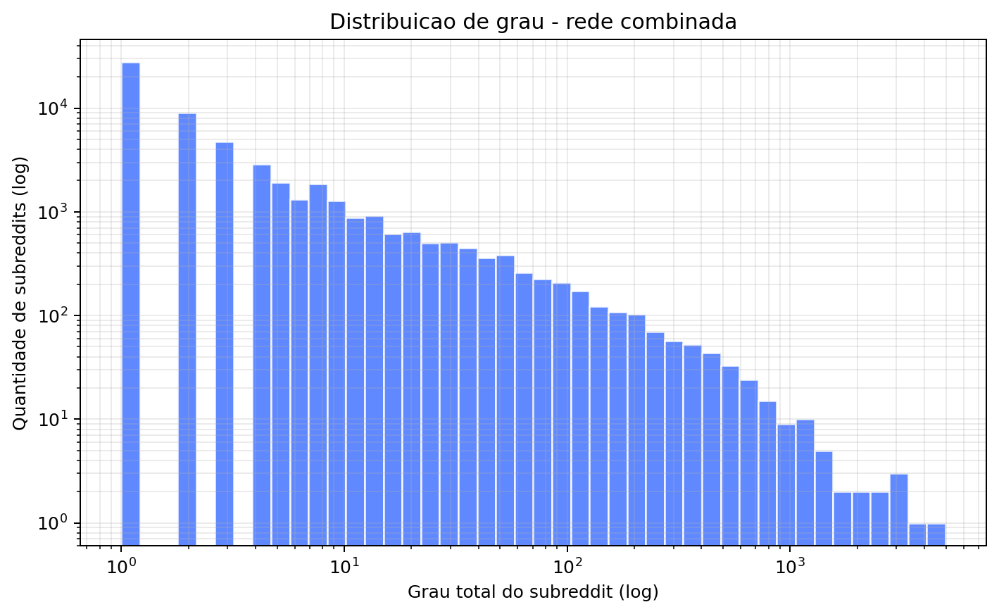

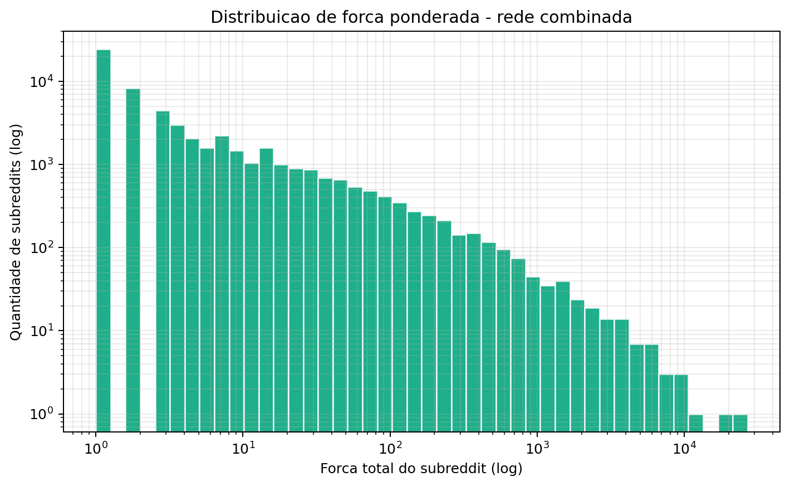

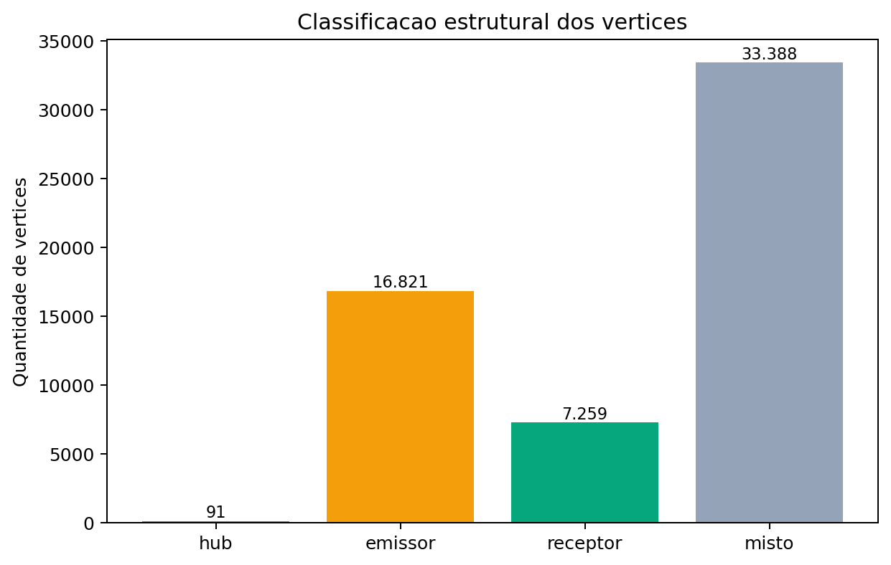

Essas figuras sustentam a interpretacao de que a rede e heterogenea: muitos subreddits possuem poucas conexoes, enquanto poucos vertices concentram grau e forca muito elevados.

### 7.2 Comunidades, pontes e articulacao

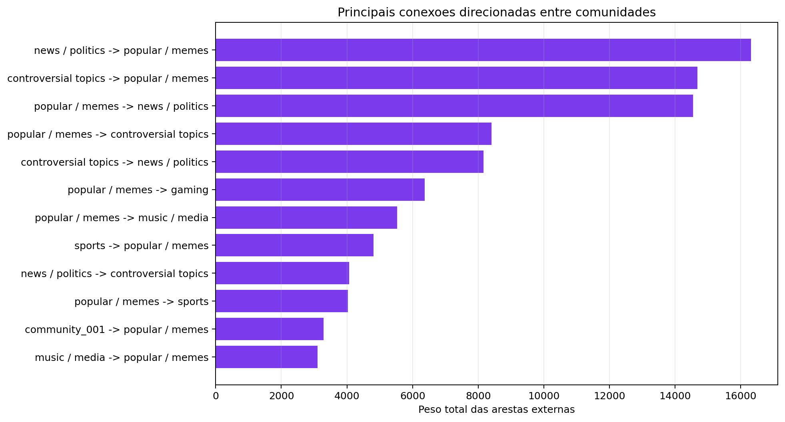

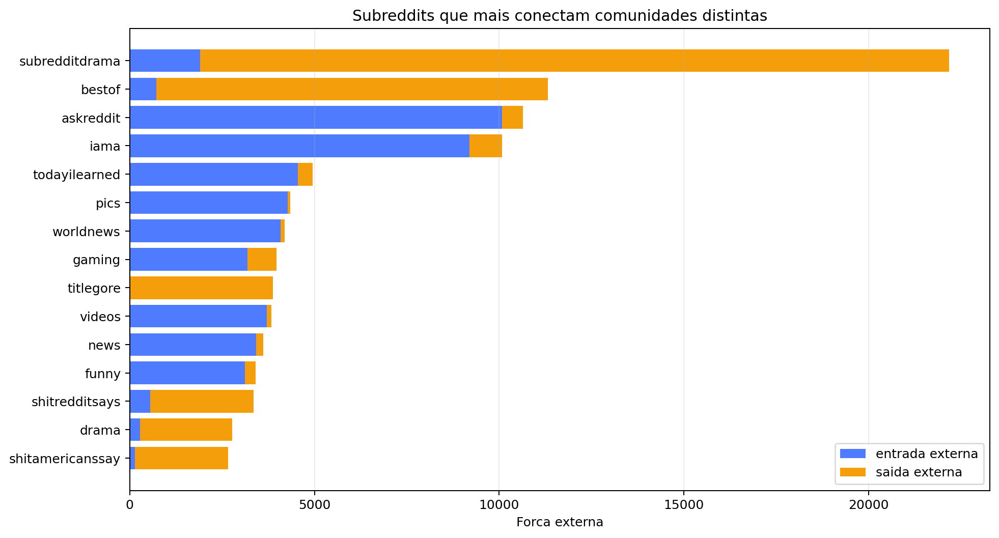

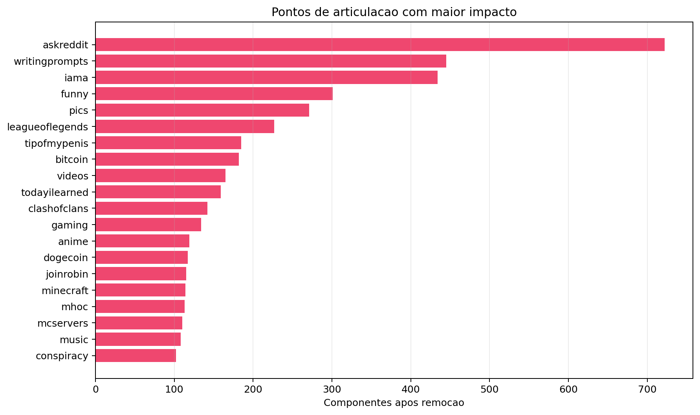

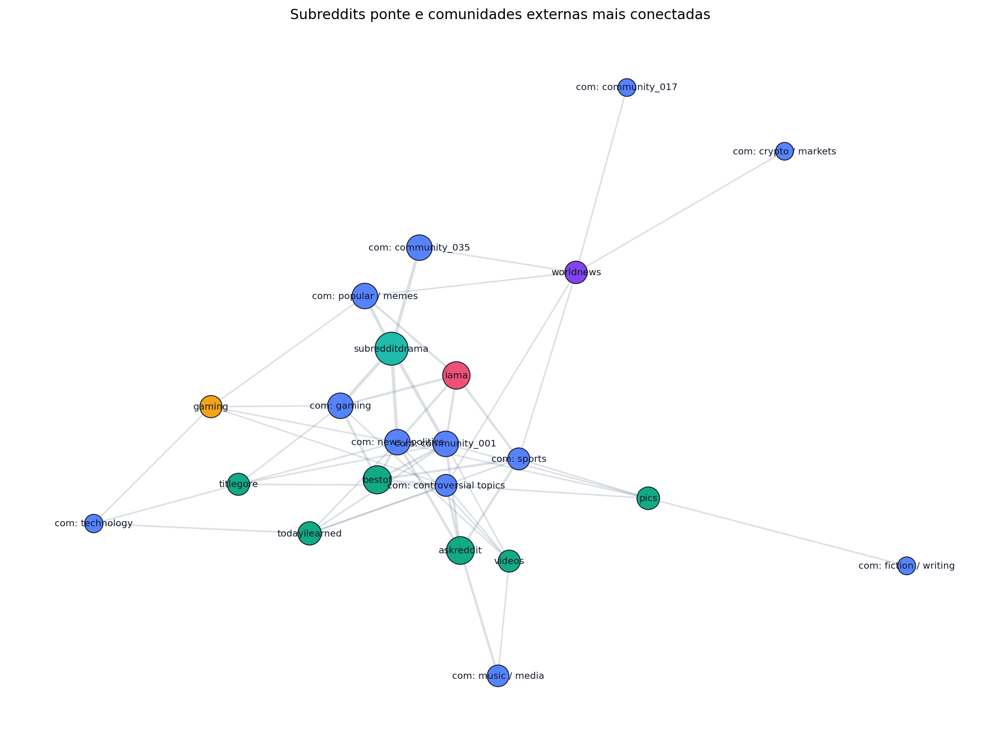

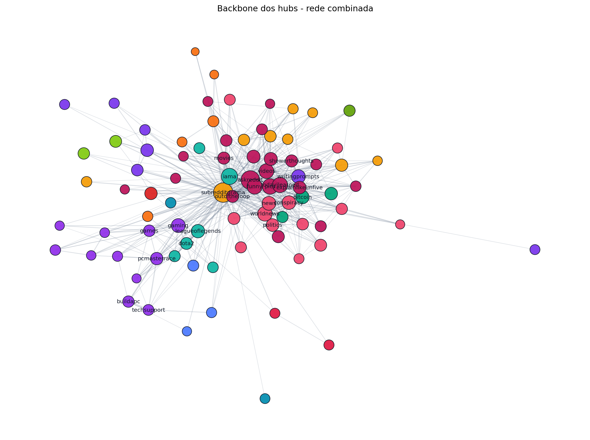

Essas figuras mostram quais comunidades trocam mais hyperlinks, quais subreddits atravessam comunidades distintas e quais vertices geram maior fragmentacao quando removidos.

### 7.3 Analise temporal

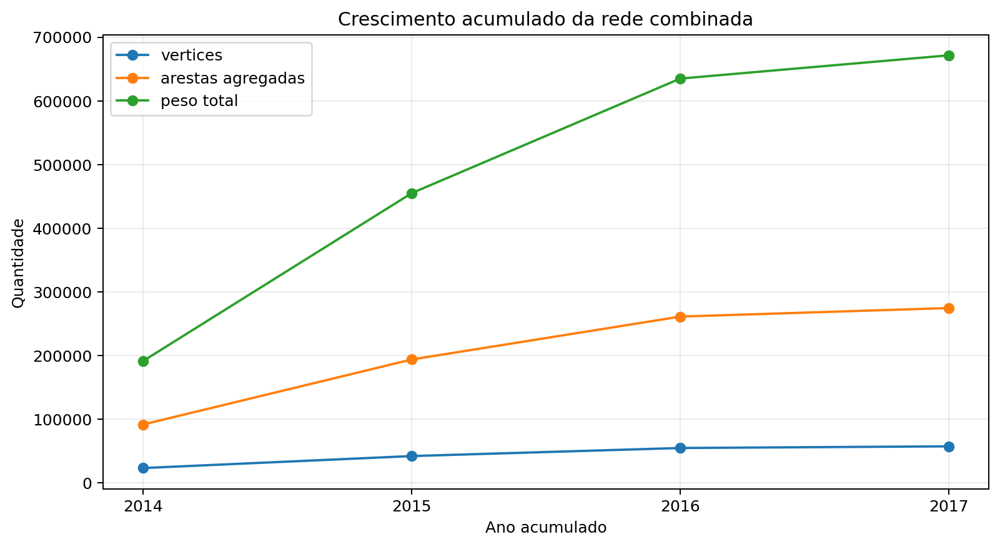

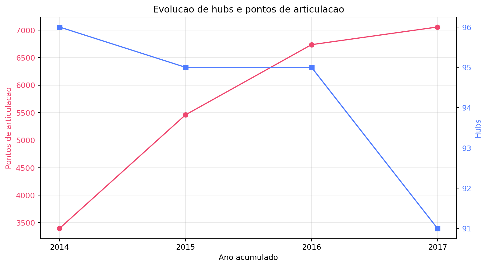

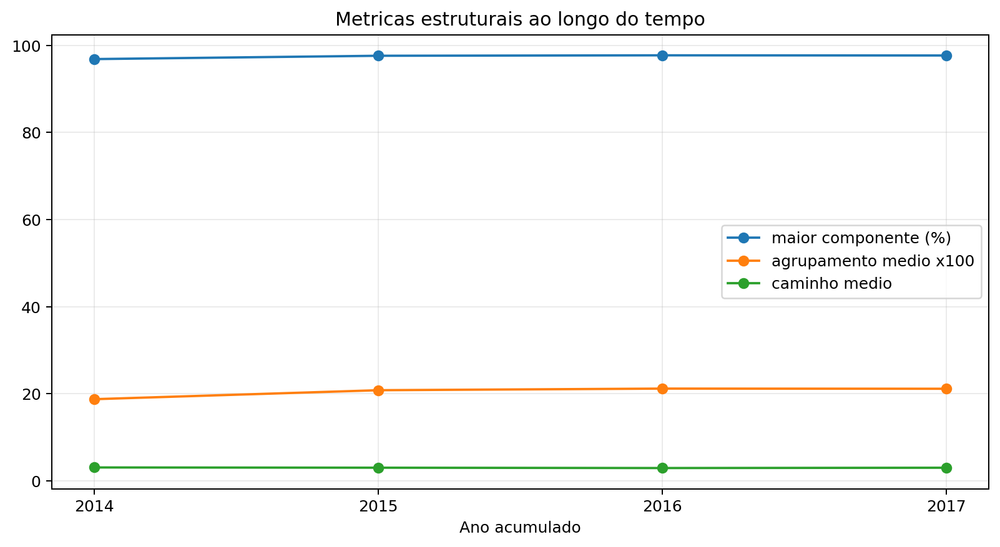

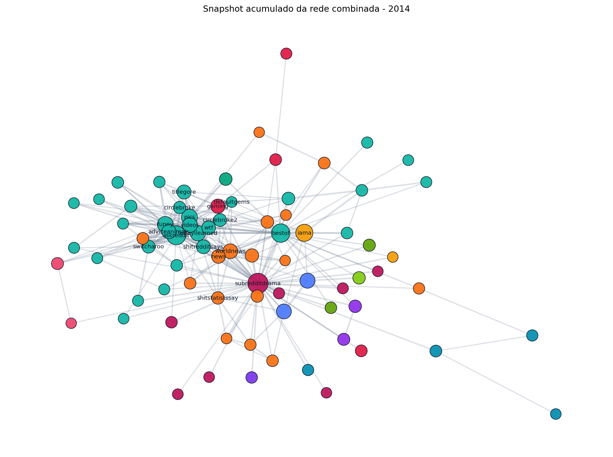

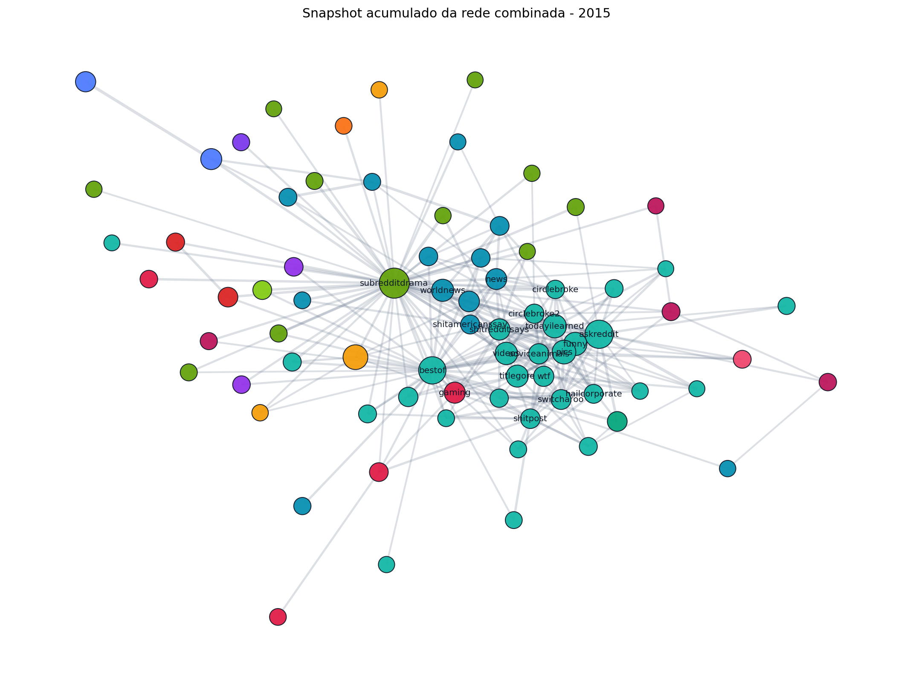

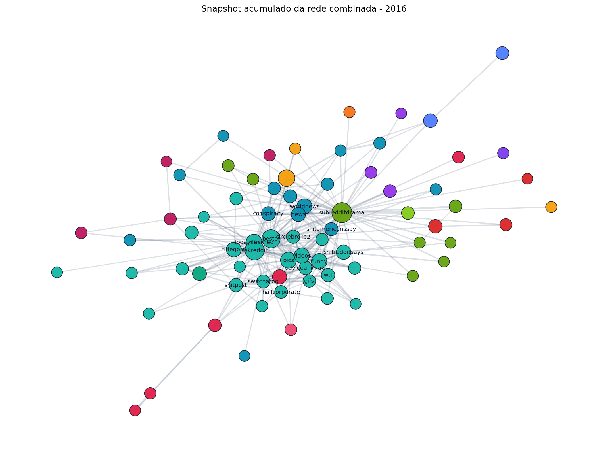

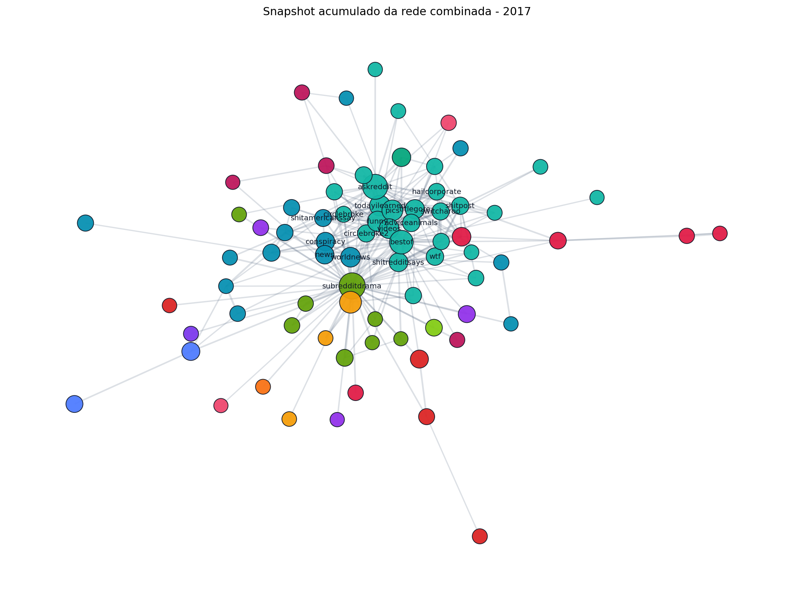

Essas figuras mostram a evolucao acumulada da rede, permitindo observar o crescimento do numero de vertices, arestas, hubs e pontos de articulacao entre 2014 e 2017.

## Referencias

[1] SNAP, "Social network: Reddit Hyperlink Network". Disponivel em: https://snap.stanford.edu/data/soc-RedditHyperlinks.html. Acesso em: 23 jul. 2026.

[2] S. Kumar, W. L. Hamilton, J. Leskovec e D. Jurafsky, "Community Interaction and Conflict on the Web", Proceedings of The Web Conference, 2018. Disponivel em: https://arxiv.org/abs/1803.03697.

[3] J. Leskovec e A. Krevl, "SNAP Datasets: Stanford Large Network Dataset Collection". Disponivel em: https://snap.stanford.edu/data/.

[4] Projeto local, `Projeto_CR/reports/duckdb_graph_store_summary.md`.

[5] Projeto local, `Projeto_CR/app/visualization/public/graph-structural-metrics.json`.

[6] Projeto local, `Projeto_CR/reports/articulation_points_combined_largest_component.csv`.

[7] Projeto local, `Projeto_CR/reports/temporal_combined_growth_metrics.csv`.

[8] Projeto local, `Projeto_CR/reports/intercommunity_node_bridges_combined.csv`.
