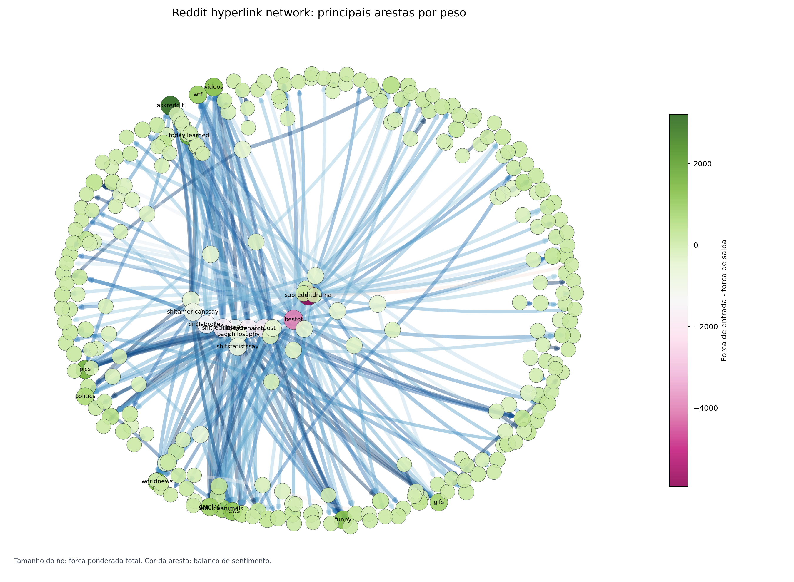
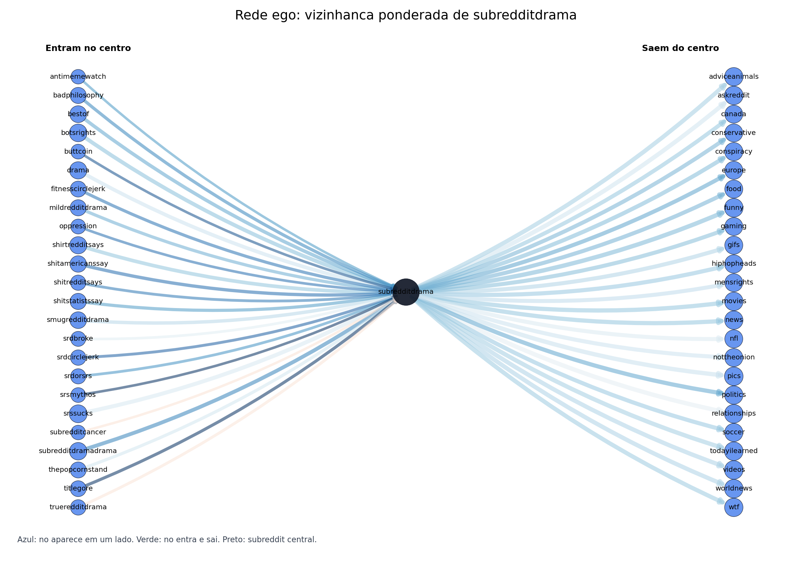
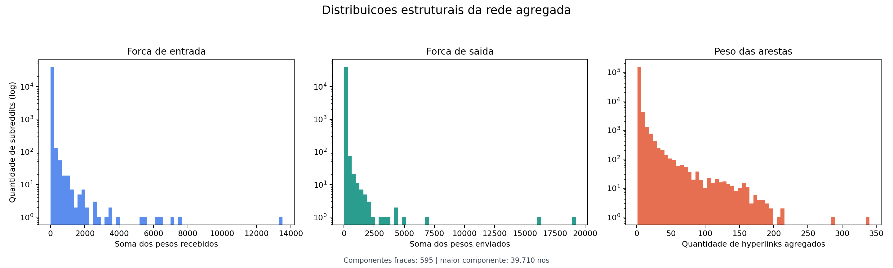

# Guia de visualizacao do grafo Reddit SNAP

Este guia explica como visualizar a rede gerada a partir de
`data/processed/reddit_title_edges_gephi.csv` e como interpretar cada forma de
visualizacao com base nos conceitos dos PDFs de aula.

## 1. O que esta sendo visualizado

Na modelagem atual, cada no e um subreddit e cada aresta dirigida representa um
hyperlink de um subreddit de origem para um subreddit de destino.

Exemplo:

```text
subredditdrama -> funny
```

Significa que houve hyperlinks saindo de `subredditdrama` para `funny`. Como o
CSV foi agregado, a coluna `weight` indica quantas vezes essa relacao apareceu.
As colunas `positive` e `negative` preservam o sinal das interacoes.

Essa leitura conversa diretamente com:

- Aula 2, quando redes sao apresentadas como conjuntos de vertices/nos e
  arestas/links.
- Aula 3, quando a notacao de grafo `G = (V, E)` e usada para separar conjunto
  de vertices e conjunto de arestas.
- Aula 4, quando a revisao diferencia grafos direcionados, nao direcionados,
  ponderados e nao ponderados.

No seu caso, o grafo e:

- direcionado: `Source -> Target` tem sentido;
- ponderado: `weight` mede intensidade da relacao;
- assinado por atributo: `positive` e `negative` indicam o tipo de interacao;
- grande: 40.964 nos e 163.785 arestas agregadas.

Por isso, desenhar a rede inteira de uma vez tende a gerar uma imagem
ilegivel. A estrategia correta e alternar entre visoes filtradas, estatisticas
e subgrafos.

## Mapa rapido dos PDFs usados

Use estes trechos dos PDFs como apoio conceitual no relatorio ou na
apresentacao:

| PDF | Onde olhar | Como usar no projeto |
| --- | --- | --- |
| Aula 2 - introducao a redes | paginas extraidas 33, 37 e 44 | definicao de rede/grafo, exemplo de direcao em ruas de mao unica, propriedades estatisticas como grau e caminhos |
| Aula 3 - teoria dos grafos | paginas extraidas 5 e 11 | formalizacao de grafo, caminhos, distancia e representacoes |
| Aula 4 - grafos bipartidos | paginas extraidas 2 e 9 | diferenca entre grafo direcionado/ponderado e alternativa bipartida por redes de afiliacao |
| Aula 5 - busca em grafos | paginas extraidas 1 e 6 | vizinhanca, busca em largura/profundidade e menor caminho |
| Aula 6 - centralidades | paginas extraidas 4, 8, 13, 15, 17, 20, 41 e 51 | grau, grau ponderado, intermediacao, proximidade, autovetor/PageRank e metricas recomendadas para o projeto |

## 2. Visualizacao de subgrafo por arestas fortes

Arquivo gerado:

```text
Projeto_CR/results/figures/reddit_title_top_edges.png
```



Esta figura mostra apenas as arestas com maior peso. Ela responde a pergunta:

```text
Quais relacoes entre subreddits aparecem com mais intensidade?
```

Como ler:

- nos maiores tem maior forca ponderada total;
- setas indicam direcao do hyperlink;
- arestas mais grossas representam maior `weight`;
- cores das arestas indicam o balanco de sentimento;
- labels aparecem apenas para os subreddits mais fortes, para evitar poluicao.

Conceito de aula:

- Aula 3: grafo direcionado e ponderado.
- Aula 2: redes reais podem ser estudadas por propriedades estatisticas e por
  significado das conexoes.

Boa pratica:

Use essa visualizacao como uma "espinha dorsal" da rede. Ela nao mostra todos
os dados, mas mostra a parte mais forte da estrutura.

## 3. Rede ego

Arquivo gerado:

```text
Projeto_CR/results/figures/reddit_title_ego_network.png
```



Esta figura foca em um unico subreddit central. O script escolheu
`subredditdrama`, porque ele tem a maior forca ponderada total na rede.

Ela responde:

```text
Quem aponta para este subreddit e para quem ele aponta?
```

Como ler:

- esquerda: subreddits que linkam para o centro;
- direita: subreddits para os quais o centro linka;
- centro preto: subreddit escolhido;
- linhas mais grossas: relacoes mais repetidas;
- azul/vermelho na aresta: balanco de sentimento.

Conceito de aula:

- Aula 5: busca/percurso em grafos. A rede ego equivale a uma vizinhanca de
  distancia 1 ao redor de um no.
- Aula 3: caminhos, vizinhanca e direcao das arestas.
- Aula 6: centralidade local, pois a importancia de um no pode ser observada
  pelo volume e direcao das conexoes ao redor dele.

Quando usar:

- para explicar um caso concreto no relatorio;
- para comparar entrada vs saida de um subreddit;
- para evitar a confusao visual do grafo completo.

Para trocar o centro:

```powershell
python Projeto_CR\src\visualize_reddit_graph.py --ego-center askreddit
```

## 4. Distribuicoes estruturais

Arquivo gerado:

```text
Projeto_CR/results/figures/reddit_title_distributions.png
```



Esta visualizacao nao tenta desenhar a rede. Ela mostra distribuicoes:

- forca de entrada: soma dos pesos recebidos por cada subreddit;
- forca de saida: soma dos pesos enviados por cada subreddit;
- peso das arestas: quantos hyperlinks foram agregados em cada par
  `Source -> Target`.

Conceito de aula:

- Aula 2: propriedades estatisticas das redes.
- Aula 6: centralidade por grau/forca. Em grafo ponderado, a forca e uma versao
  ponderada do grau.

O eixo vertical esta em escala logaritmica porque ha muitos subreddits com
poucas conexoes e poucos subreddits extremamente conectados. Esse padrao e
comum em redes reais e ajuda a justificar por que a visualizacao completa fica
densa rapidamente.

Resultado observado:

- a maior componente fraca tem 39.710 nos;
- existem 595 componentes fracas;
- ha 30.082 componentes fortemente conexas;
- a rede tem muito mais links positivos/neutros (343.808) do que negativos
  (41.107).

## 5. Centralidades e ranking

Resumo gerado:

```text
Projeto_CR/results/figures/reddit_title_visual_summary.md
```

Os maiores subreddits por forca ponderada total foram:

| subreddit | forca de entrada | forca de saida | forca total |
| --- | ---: | ---: | ---: |
| subredditdrama | 1933 | 19249 | 21182 |
| bestof | 787 | 16105 | 16892 |
| askreddit | 13525 | 0 | 13525 |
| iama | 7516 | 2 | 7518 |
| pics | 7147 | 176 | 7323 |

Como interpretar:

- `subredditdrama` e `bestof` aparecem como grandes emissores de links;
- `askreddit`, `iama`, `pics`, `funny` e `worldnews` aparecem mais como alvos;
- entrada e saida devem ser analisadas separadamente porque a rede e dirigida.

Conceito de aula:

- Aula 6: centralidade mede diferentes formas de importancia.
- Grau/forca de entrada: popularidade ou capacidade de atrair links.
- Grau/forca de saida: atividade de apontar para outros subreddits.
- Betweenness e closeness podem ser calculadas depois em subgrafos menores,
  porque no grafo completo elas podem ser computacionalmente caras.

## 6. Visualizacao interativa

Arquivo gerado:

```text
Projeto_CR/results/interactive/reddit_title_top_edges.html
```

Abra esse HTML no navegador para mover os nos, dar zoom e inspecionar arestas.
Ele e melhor que PNG quando a pergunta exige exploracao manual.

Quando usar:

- para apresentar em sala;
- para procurar padroes visualmente;
- para clicar em nos e arestas;
- para decidir quais subgrafos merecem uma figura estatica no relatorio.

## 7. Onde entram grafos bipartidos

A Aula 4 trata de redes de afiliacao e grafos bipartidos, nos quais ha dois
tipos de vertices. O CSV agregado atual nao e bipartido: ele ja e uma rede
direta subreddit-subreddit.

Mas a base bruta permite uma modelagem bipartida alternativa:

```text
postagem -> subreddit de origem
postagem -> subreddit de destino
```

ou:

```text
subreddit -> postagem
```

Depois, seria possivel projetar essa rede bipartida para obter:

- rede subreddit-subreddit: dois subreddits ligados por participarem da mesma
  postagem/hyperlink;
- rede postagem-postagem: postagens ligadas por subreddits em comum.

Conceito de aula:

- Aula 4: redes de afiliacao, grafos bipartidos e projecao.
- Aula 5: a projecao muda os caminhos possiveis e, portanto, muda buscas e
  distancias.

Use essa abordagem se a pergunta do projeto mudar de "quem linka para quem?"
para "quais comunidades aparecem associadas ao mesmo evento/postagem?".

## 8. Como regenerar as visualizacoes

Com os parametros padrao:

```powershell
python Projeto_CR\src\visualize_reddit_graph.py
```

Com mais arestas no subgrafo:

```powershell
python Projeto_CR\src\visualize_reddit_graph.py --top-edges 650
```

Com filtro minimo de peso:

```powershell
python Projeto_CR\src\visualize_reddit_graph.py --min-weight 100
```

Com outro centro para rede ego:

```powershell
python Projeto_CR\src\visualize_reddit_graph.py --ego-center askreddit
```

## 9. Sugestao de uso no relatorio

Uma boa sequencia para apresentar os resultados e:

1. Comecar pelas distribuicoes para mostrar que a rede e grande e desigual.
2. Mostrar a rede filtrada por arestas fortes para revelar a estrutura geral.
3. Usar uma rede ego para explicar um caso concreto.
4. Apresentar ranking de centralidade ponderada.
5. Discutir limitacoes: layout visual nao prova causalidade, filtros removem
   arestas fracas, e centralidade depende da metrica escolhida.

Essa ordem conecta bem os conceitos das aulas: definicao de rede/grafo,
direcao e peso, propriedades estatisticas, busca/vizinhanca e centralidade.
